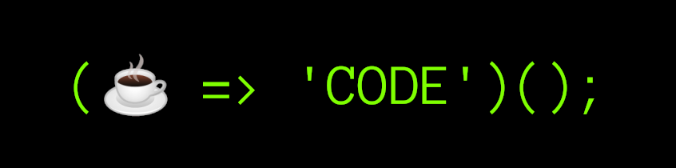

<h1 align="center">👋 Howdy! I'm PlankCipher</h1>

A curious self-taught developer who strives to keep learning interesting stuff.

- 👨‍💻 I’m currently working on [**kabmat**](https://github.com/PlankCipher/kabmat).
- 🌱 I’m currently learning more **C++**.
- ❤️ I love **FOSS** so much.
- 💬 Reach out to me **@plankcipher** on **Discord**, [**@u/PlankCipher**](https://www.reddit.com/u/PlankCipher) on **Reddit**, or via **email** at **plankcipher1@protonmail.com**.

### Languages, technologies, and tools I love to use

<!-- HTML -->

<!-- CSS -->

<!-- JavaScript -->

<!-- TypeScript -->

<!-- MySQL -->

<!-- C++ -->

<!-- C -->

<!-- Go -->

<!-- Ruby -->

<!-- NASM -->

<!-- Java -->

<!-- Bash -->

<!-- Python -->

<!-- Markdown -->

<!-- Express -->

<!-- React -->

<!-- Node.js -->

<!-- Jest -->

<!-- Babel -->

<!-- Webpack -->

<!-- React Native -->

<!-- Vim -->

<!-- Emacs -->

<!-- Git -->

<!-- GitHub -->

<!-- Yarn -->

<!-- Docker -->

<!-- Heroku -->

<!-- Arch -->

<!-- Linux -->

<!-- GCC -->

<!-- Suckless Utilities -->

 
 

