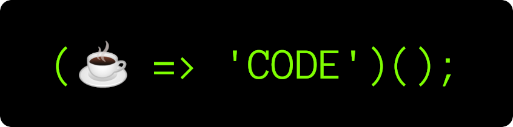

<h1 align="center">👋 Howdy! I'm PlankCipher</h1>

A curious self-taught developer who strives to keep learning interesting stuff.

- 👨‍💻 I’m currently working on [**kabmat**](https://github.com/PlankCipher/kabmat).
- 🌱 I’m currently learning more **C++**.
- ❤️ I love **FOSS** so much.
- 💬 Reach out to me **@plankcipher** on **Discord**, [**@u/PlankCipher**](https://www.reddit.com/u/PlankCipher) on **Reddit**, or via **email** at **plankcipher1@protonmail.com**.

### Languages, technologies, and tools I love to use

<!-- HTML -->

<!-- CSS -->

<!-- JavaScript -->

<!-- TypeScript -->

<!-- PHP -->

<!-- C# -->

<!-- C -->

<!-- C++ -->

<!-- Rust -->

<!-- Go -->

<!-- Ruby -->

<!-- Java -->

<!-- Dart -->

<!-- Kotlin -->

<!-- Bash -->

<!-- Python -->

<!-- Markdown -->

<!-- Lua -->

<!-- Nim -->

<!-- NASM -->

 
 

<!-- React -->

<!-- AngularJS -->

<!-- Vuejs -->

<!-- Bootstrap -->

<!-- Sass -->

<!-- Tailwind -->

<!-- Pug -->

<!-- NextJS -->

<!-- Svelte -->

<!-- Vite -->

<!-- Laravel -->

<!-- Express -->

<!-- Flask -->

<!-- Django -->

<!-- DotNet -->

<!-- WASM -->

<!-- Flutter -->

<!-- React Native -->

<!-- Electron -->

<!-- Qt -->

<!-- GTK -->

<!-- OpenCV -->

<!-- PyTorch -->

<!-- P5JS -->

<!-- Processing -->

 
 

<!-- MySQL -->

<!-- PostgreSQL -->

<!-- SQLite -->

<!-- MongoDB -->

<!-- Firebase -->

<!-- GitHub Actions -->

<!-- Heroku -->

<!-- AWS -->

<!-- Nginx -->

<!-- GraphQL -->

<!-- Postman -->

<!-- Yarn -->

<!-- Docker -->

<!-- Node.js -->

<!-- Jest -->

<!-- Babel -->

<!-- Webpack -->

<!-- Android Studio -->

<!-- Neovim -->

<!-- Emacs -->

<!-- Git -->

<!-- GitHub -->

<!-- Arch -->

<!-- Linux -->

<!-- GCC -->

<!-- Suckless Utilities -->

 
 

